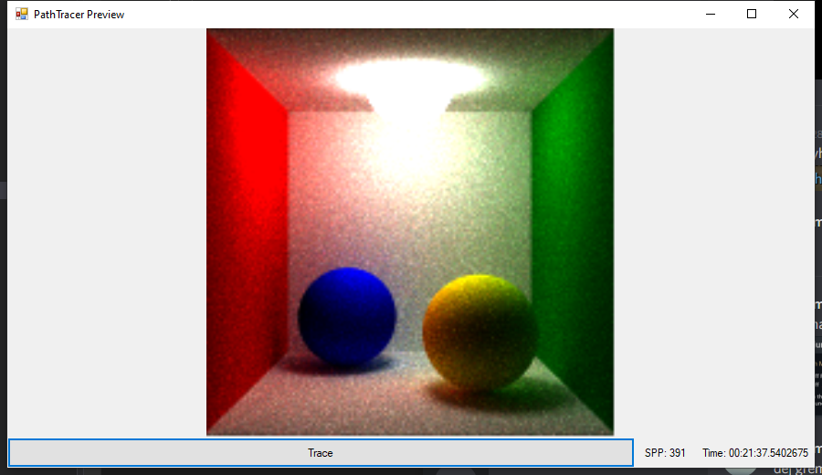

# Path Tracer

Simple path tracer created for my Advanced Computer Graphics class.

## Renders

More images can be found in [`renders/`](renders/).

## Features

* Path tracing
	* Russian roulette stopping
	* Importance sampling
* Spherical lights
	* Configurable emission side (inner, outer, both) `SideEnum`
* Oren-Nayar BRDF material
	* Configurable roughness parameter `sigma`
